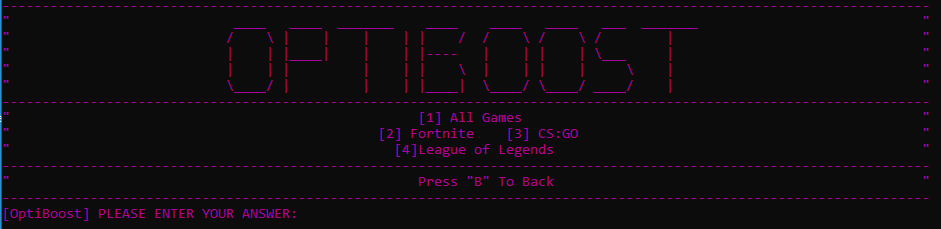
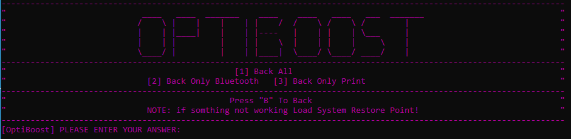
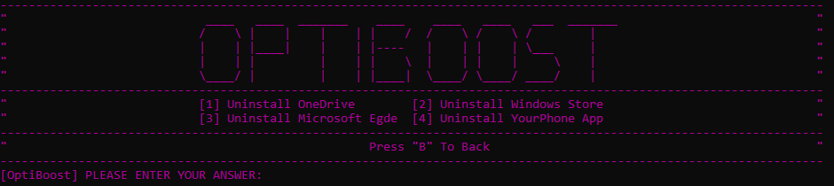
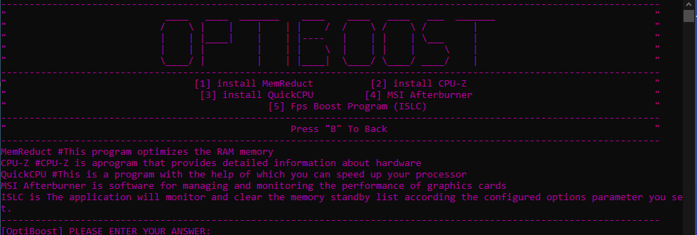
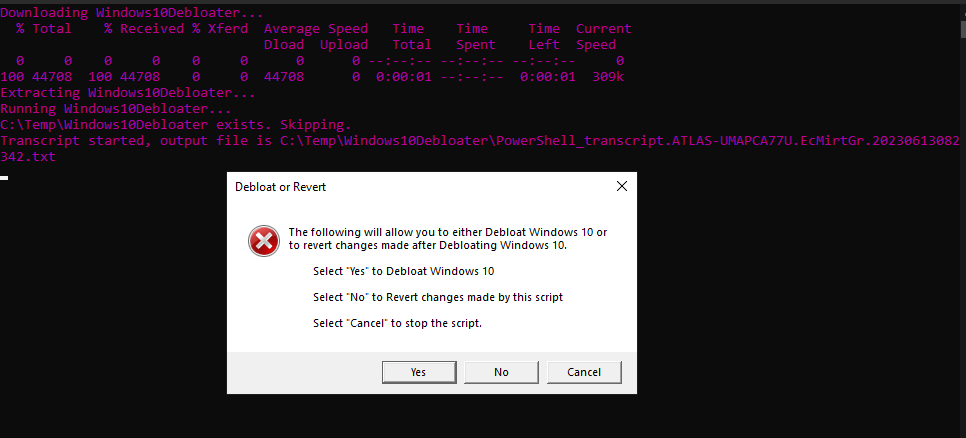
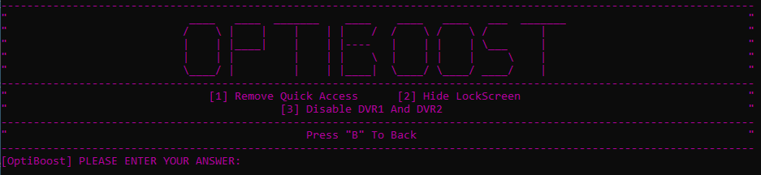
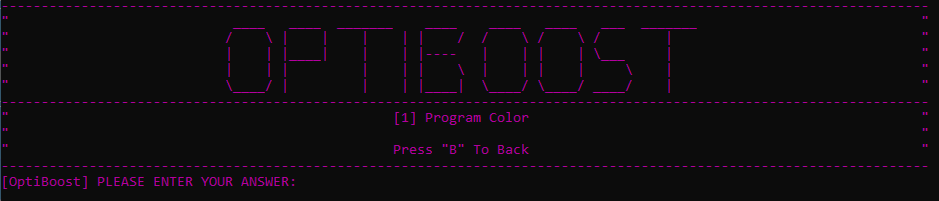

# OptiBoost
this program was created to speed up, get more FPS in Games on Low End PC.

  
  this program was created to speed up, get more FPS in Games on Low End PC.
  
  
  

## More About the Program
- {x} [What does this script do?](#WHAT-DOES-THIS-SCRIPT-DO)
- {x} [Download Last Release](https://github.com/onajlikezz/OptiBoost/releases)
- {x} [Game Configurations](#Game-Configurations)
- {x} [Services that OptiBoost disables](#Disable-Services)
- {x} [Services that OptiBoost Enables](#Enable-Services)
- {x} [Uninstall Windows Programs](#Uninstall-Windows-Programs)
- {x} [Programs For Optimization](#Programs-For-Optimization)
- {x} [Windows Debloater](#Windows-Debloater)
- {x} [Windows Configurations](#Windows-Configurations)
- {x} [Appearance](#Appearance)
- {x} [Support](#SUPPORT)

## WHAT DOES THIS SCRIPT DO?
This script **shuts down services**, adds a **special power plan**, changing game configs and makes some **other tweaks** to the computer for *more performance and fewer processes.*

  

## Game Configurations

  This script (in Last Release) Have Configurations For: All Games (Only Set All To High Priority), Fortnite, CS:GO, League of Legends
  

## Disable Services
SERVICES THAT THIS SCRIPT STOPS:

    TrustedInstaller(Windows Modules Installer),
    wuauserv (Windows Update),
    bthserv (Bluetooth Support Service),
    BTAGService (Bluetooth Audio Gateway Service),
    BthHFSrv (Bluetooth Handsfree Service),
    BthHfAudSvc (Bluetooth Handsfree Audio Service),
    BthUserService (Bluetooth User Support Service),
    das (Data Sharing Service),
    DmEnrollmentSvc (Device Management Enrollment Service),
    Spooler (Print Spooler),
    XblAuthManager (Xbox Live Auth Manager),
    XblGameSave (Xbox Live Game Save),
    XboxNetApiSvc (Xbox Live Networking Service),
    RemoteRegistry (Remote Registry),
    InstallService (Windows Installer),
    EventLog (Windows Event Log),
    FontCache3.0.0.0 (Windows Font Cache Service 3.0.0.0),
    icssvc (Internet Connection Sharing (ICS)),
    FontCache (Windows Font Cache Service),
    Wecsvc (Windows Event Collector),
    WEPHOSTSVC (Wired AutoConfig),
    Themes (Themes),
    SSDPSRV (SSDP Discovery),
    ShellHWDetection (Shell Hardware Detection),
    LanmanServer (Server),
    SstpSvc (Secure Socket Tunneling Protocol Service),
    RasMan (Remote Access Connection Manager),
    QWAVE (Quality Windows Audio Video Experience),
    PcaSvc (Program Compatibility Assistant Service),
    WPDBusEnum (Portable Device Enumerator Service),
    NetTcpPortSharing (Net.Tcp Port Sharing Service),
    diagnosticshub.standardcollector.service (Diagnostics Hub Standard Collector Service),
    KtmRm (KtmRm for Distributed Transaction Coordinator),
    IpxlatCfgSvc (IP Translation Configuration Service),
    iphlpsvc (IP Helper)

## Enable Services

  If you need Printer, Bluetooth or Both Services, you can return them.
  

## Uninstall Windows Programs

  OptiBoost can also delete these programs:
  

## Programs For Optimization  

  OptiBoost removes programs that improve performance and overclock:
  

## Windows Debloater
  This part of the script downloads the Original Windows Debloater and runs it:
  

 
## Windows Configurations
  With this script, you can turn off all Windows Things that you don't use:
  

## Appearance
  Here you can change the appearance (only the color for now) of the script:
  

## SUPPORT
IF YOU HAVE ANY QUESTIONS [CLICK HERE](https://discord.gg/9S28yfAVWq) TO ENTER DSCORD SERVER
OR ADD ME ON DISCORD: onajlikezz#1111

<!--🐍📈SNAKEGRAPH / 🌐WEBSITE: https://github.com/Platane/snk -->

